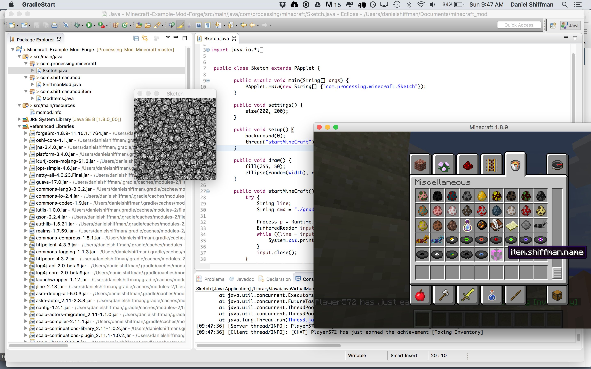

# Minecraft Ecologies

This is the repo for the Minecraft Ecologies class at Bauhaus-Uni Weimar.

## Working with Minecraft Mods + Versions

The easiest way to start modding minecraft, is to use **MultiMC**.

### Modpacks ###

If you want to use these Examples with the Desktop version, you need to run Minecraft with a mod that provides the MCPI API.

* The [MCPI modpack](mcpi/MCPI.zip) includes the *MCPI Mod*.
* The [RaspberryJam Modpack](mcpi/RaspberryJam.zip) includes *Raspberry Jam*, another MCPI API mod, that is under active development.

To use modpacks create a new Minecraft instance in MultiMC, and chose import modpack.

## Examples ##

These Processing examples include a copy of [MCPI.jar](mcpi/MCPI.jar).  
This jar contains the code to connect to Minecraft via TCP as specified in the *Minecraft API*.  

You can also download the jar [here](https://github.com/zhuowei/RaspberryJuice/raw/master/src/main/resources/mcpi/api/java/McPi.jar).  
The original Minecraft API + source code published by Minecraft can be found [here](https://s3.amazonaws.com/assets.minecraft.net/pi/minecraft-pi-0.1.1.tar.gz).

#### MCPI Examples ####

* [Drag Me](examples/DragME)
* [Hello Pi](examples/HelloPi)
* [Turtle Demo](examples/Turtle Demo)

To create your own Processing sketches, just drag the jar onto your sketch, and Processing will automatically create a `code` folder inside your sketch and add the jar to it.

#### MCPI-API via TCP ####

This example shows how to use Processing to talk to Minecraft via TCP directly.  
Note: You can also use `telnet` to connect to minecraft and experiment with the API.

* [Exodus](examples/Exodus)

#### Geometry with MCPI  ###

Here are some examples to created *3D geometry*:

* [Sphere](examples/Sphere)
* [Performance Test](examples/PerformanceTest)

RaspberryJam comes with a lot of example scripts for [python 2](https://github.com/arpruss/raspberryjammod/tree/master/python2-scripts/mcpipy) and [python 3](https://github.com/arpruss/raspberryjammod/tree/master/python3-scripts/mcpipy).  
Here is an example ported to Processing:  

* [Dragon Curve](examples/DragonCurve)

#### Processing + Minecraft + Tracking ####

We got a tracking system by the Captury with an OpenSoundControl plugin.  
The OSC interface is still very much under development.  
To connect it you currently need an OSC proxy (implemented as a PureData patch).
The Processing sketches use the `oscP5` library.

* [The Captury Proxy](tracking/the_captury_proxy.pd) (PureData)
* [The Captury Test](tracking/the_captury_test)
* [The Captury to Minecraft](tracking/the_captury_to_minecraft)

### Processing and the Forge ###

If you want to create Mods using *the Forge* you need to install Eclipse or IntelliJ, and get the source of *the Forge*.

To get a version that comes with Processing examples, check out Dan Shiffman's version [here](https://github.com/shiffman/Processing-Mod-Minecraft).   

Once you have cloned the repo or downloaded the zip, you need to open a terminal and install, decompile and setup everything with `gradelew` as described in the [README](https://github.com/shiffman/Processing-Mod-Minecraft/blob/master/Minecraft-Example-Mod/README.txt).

#### Working with IntelliJ ####

In our class we are using the IntelliJ Community Edition to create our Mods.  
You can download it [here](https://www.jetbrains.com/idea/download/).

#### Forge Modding Examples ####

There is a very nice book by Aditya Gupta about *Minecraft Modding with Forge*.  
All the examples can be found [here](https://github.com/AdityaGupta1/minecraft-modding-book).
Use  `gradelew` as before!

## Links ##

* [MCPI Mod](https://github.com/kbsriram/mcpiapi)
* [Raspberry Jam Mod](https://github.com/arpruss/raspberryjammod)
* [Processing-Mod-Minecraft](https://github.com/shiffman/Processing-Mod-Minecraft)
